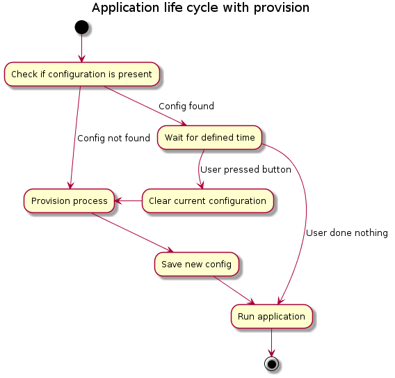

# Provisioning library for Contiki based constrained devices

Visit us at [forum.creatordev.io](http://forum.creatordev.io) for support and discussion


This project provides a library which can be added to any application that requires constrained device provisioning. It's designed to deliver PSK and other configuration data needed to connect an [Awa client](https://github.com/FlowM2M/AwaLWM2M) to [Device Server](http://creatordev.io/). This repository also contains an example which demonstrates how provisioning might be added to your application.

This library is part of bigger solution which includes components such as Ci40 scripts, daemon, mobile and web application. More info about whole solution can be found at [wiki](http://putProperLinkHere)

## Getting started

After you create your application project you should add sources from this library. Please note that from this moment your device shouldn't run your process directly, but should run the provisioning library process instead, which will later run your process. To instruct the Contiki platform to do that you have to add Boot process and make it auto-start. Add these lines to your code:
```c
PROCESS(bootProcess, "Boot process");
AUTOSTART_PROCESSES(&bootProcess);

PROCESS_THREAD(bootProcess, ev, data)
{
  PROCESS_BEGIN();
  provision_boot(&YourApplicationProcess, ConfigCallback);
  PROCESS_END();
}
```
Finally, you have to add a function (in example above it's called ConfigCallback) which will be called when configuration is available, this function will be called just before running your app process. Mentioned function should look like:

```c
void ConfigCallback(Provision_Configuration* config) {
  printf("Config callback\n");
}
```

**Important:** Make sure that you have enabled proper Contiki modules, please refer to [project-conf.h](../project-conf.h) and [Makefile](../Makefile) files.

**Logging:** If you want to see logs from provisioning process please define **PROVISION_DEBUG** macro in your project-conf.h, however you probably don't want this in production ready code.

## Sequence of boot process

Diagram below shows main steps in application lifecycle handled by this provisioning library


Detailed info about each state:

**"Check if configuration is present"** - Library uses [coffee filesystem](https://github.com/contiki-os/contiki/wiki/File-systems#Coffee) to store configs in non volatile memory. In this step, a check is done to ensure that the configuration is present.

**"Wait for defined time"** - If configuration is present on constrained device then we give user some time to react. He might want to wipe out those data and perform provisioning again. To do so after device is booting some delay is done before moving to next phase. If in this time the user presses a button, the old data is cleared. To control the amount of time edit **PROVISION_WAIT_TIME_TO_BOOT** macro from *provision_library.h* file.

**"Clear current configuration"** - Wipeout all configs from filesystem.

**"Provision process"** - In short, this completes all actions which are erquired to obtain configs from [Provisioning Daemon](http://putProperLinkHere) which should be running on Ci40. The address of this daemon is obtained through mDNS domain discovery; the name of domain to be searched can be configured by macro **PROVISION_DAEMON**; the port on which the daemon runs is stored in **PROVISION_DAEMON_PORT**. Both macros can be found in *provision_library.h* file.

**"Save new configs"** - After data are obtained from Provisioning Daemon, the library stores it in the devices filesystem.

**"Run application"** - This step covers two aspects. First it executes callback function passed through call to *provision_boot(struct process,ProvisionConfigCallback)* to deliver configuration. Then it executes a process which belongs to the application to be run.

## How Provision process look in detail
In this paragraph you will find the steps done by the provisioning library when provisioning is started. There is also description of signals given by LEDs.
  1. Just after entering provisioning mode left LED is turned on.
  2. Few milliseconds after step one right LED starts to blink rapidly indicating that library is calculating it's public key. This will take several seconds.
  3. Right LED is turned off, left LED starts to slowly blink. This mean that library is doing mDNS resolve, and tries to connect to Provisioning daemon.
  4. If connection is established and stable left LED starts to blink faster.
  5. If clicker is connected, and Provisioning daemon will select this clicker right LED is turned on (while left is fast blinking).
  6. There is no indication that Ci40 is sending anything to us. Under the hood several things are taking place:
    * Sending and receiving keep alive packets.
    * Sending and receiving public keys.
    * Receiving configuration.
  7. After both Ci40 public key and configs are received, the library is moves onto the next step. The right LED starts to blink rapidly, this indicates computation of shared key, and decrypting configs.
  8. The last step doesn't have indication. In this step, the configs are verified and saved to the filesystem. If for some reason an error occurs, both LED turn on and then the board will restart. Possible errors are:
    * config is not valid, one of the expected fields is blank.
    * problem with storing into filesystem (probably lack of memory, or exhaustion of write cycles).

## FAQ
Nothing yet...

## CONTRIBUTING

If you have a contribution to make please follow the processes laid out in [contributor guide](CONTRIBUTING.md).
